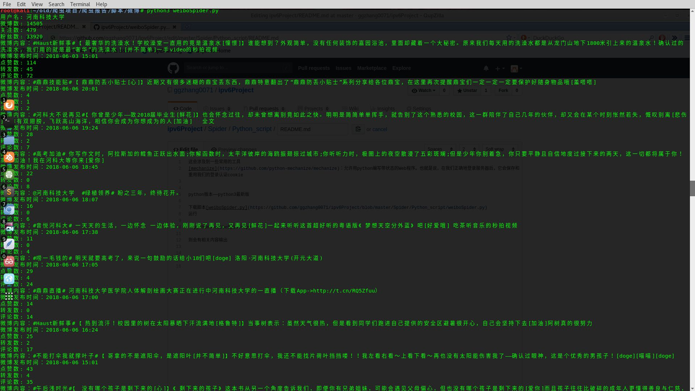

### python版本
    python3 任意版本

下载脚本[weiboSpider.py](https://github.com/ggzhang0071/ipv6Project/blob/master/Spider/Python_script/weiboSpider.py)

将[脚本内容](https://github.com/ggzhang0071/ipv6Project/blob/1bddbc508a3e2516d705f2c70c1046a820d59f70/Spider/Python_script/weiboSpider.py#L15)替换为自己cookie

运行

    python3 weiboSpider.py

则会有相关内容输出

输出内容为河科大学生的相关帖子内容

将输出内容重定向到文件或数据库中，即可进行自然语言的分析
  

